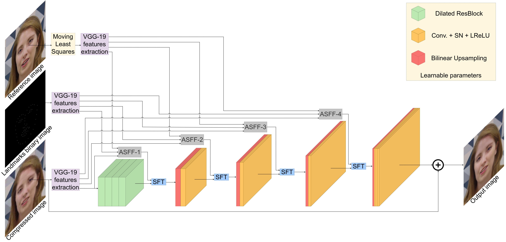

# Keyframes-GAN

## Table of Contents

* [About the Project](#about-the-project)
* [Prerequisites and Installation](#prerequisites-and-installation)
* [Usage](#usage)
  * [Testing](#testing)
* [Acknowledgments](#acknowledgments)
* [License](#license)
* [Citation](#citation)
* [Contacts](#contacts)

## About the Project


This is the official repo of the paper "GANs for Perceptual Quality Improvement in VideconferencingUsing Key Frames".

In this work we propose a novel GAN architecture for compression artifacts reduction in videoconferencing. In this context,
the speaker is typically in front of the camera and remains the same for the entire duration of the transmission.
With this assumption, we can maintain a set of reference keyframes of the person from the higher quality I-frames that
are transmitted within the video streams. First, we extract multi-scale features from the compressed and reference frames.
Then, these features are combined in a progressive manner with Adaptive Spatial Feature Fusion blocks based on facial
landmarks and with Spatial Feature Transform blocks. This allows to restore the high frequency details lost after the
video compression.



## Prerequisites and Installation
1. Clone the repo
```sh
git clone https://github.com/LorenzoAgnolucci/Keyframes-GAN.git
```


2. Create a virtual env and install all the dependencies with
```sh
pip install -r requirements.txt
```


3. Even if it is not required, we strongly recommend to install ```dlib``` with GPU support


4. For metrics computation, you need to run
```sh
pip install -e pybrisque/
```


5. Download the pretrained models from [Google Drive](https://drive.google.com/drive/folders/1Hmd7k2KuLQd-A8DYbEhSgC49DQEAKwKm?usp=sharing)
and move them inside the ```pretrained_models``` folder

   
## Usage
For testing, you need one or more HQ ```mp4``` videos. These videos will be compressed with a given CRF. The face from each frame
will be cropped, aligned and then restored with our model exploiting HQ keyframes.

### Testing
1. Move the HQ videos under a directory named ```{BASE_PATH}/original/```


2. Run
```sh
python preprocessing.py --base_path {BASE_PATH} --crf 42
```

where ```crf``` is a given Constant Rate Factor (default 42)

3. Run
```sh
python video_inference.py --base_path {BASE_PATH} --crf 42 --max_keyframes 5
```
where ```crf``` must be equal to the one of step 2 and ```max_keyframes``` is the max cardinality of the set of keyframes (default 5)

4. If needed, run
```sh
python compute_metrics.py --gt_path {BASE_PATH}/original --inference_path inference/DMSASFFNet/max_keyframes_5/LFU
```
where ```gt_path``` is the directory that contains the HQ videos and ```inference_path``` is the directory that contains the restored frames

## Acknowledgments
We rely on [BasicSR](https://github.com/xinntao/BasicSR) for the implementation of our model and for metrics computation.
## License
## Citation
## Contacts
